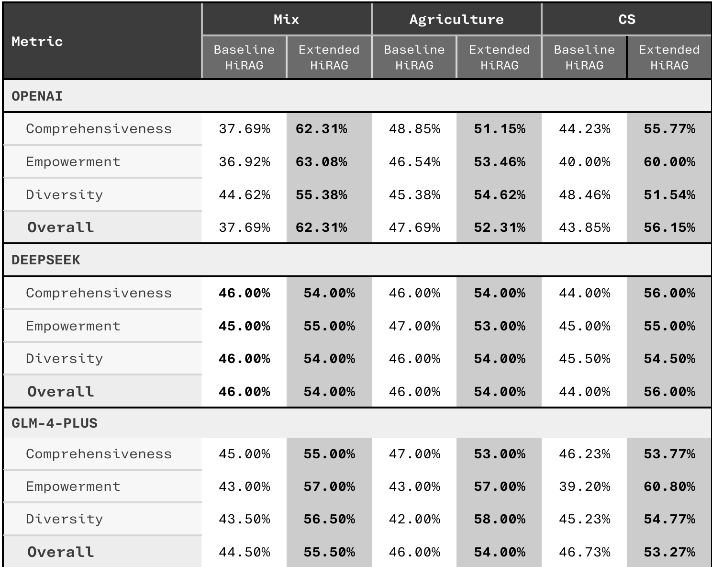

<div align="center">

# Retrieval Augmented Generation with Hierarchical Causal Knowledge with Query aware Re-ranking
</div>

## An Enhancement on the original HiRAG work done by here: https://github.com/hhy-huang/HiRAG

## Main contributer to this Enhancement work: 
- #### Devendra Kumar Rajasekaran
- #### Yousif Al Ali 

## To reproduce, follow the following steps:

First, after cloning the repo, install requirements:

``` bash
pip install -e .
```

Below are the sample script execution command to perform Indexing, Querying, generating answers and evaluating using LLMs and displaying the results.

### Important note: insert your API KEYS in config.yaml before running any code.

``` bash
cd ./HiRAG/eval
```
****************************************************************************************
Indexing:
To Insert context based on {dataset}_unique_context.json file in hi_causal mode.
```bash
python insert_context_openai.py
```
****************************************************************************************
Querying 
To generate answers to the query for a dataset in hi and hi_rerank mode. make sure to refrence the correct indexed working directory in test_openai.py

```bash
python test_openai.py -n 130 -d mix 
python test_openai.py -n 100 -d agriculture
```
****************************************************************************************
Evaluating the answers (sample with glm), similar this can be used with deepseek and Openai. make sure you use the correct file path and file names.

```bash
python batch_eval_rerank.py -m request -api glm -q ./datasets/agriculture/agriculture_query_answers.jsonl -r1 ./datasets/agriculture/Causal03/agriculture_causalrerank_result.jsonl -r2 ./datasets/agriculture/Causal03/agriculture_hi_result.jsonl -o ./datasets/agriculture/Causal03/agriculture_causalrerank_causal.jsonl
```

****************************************************************************************
Display the results:

```bash
python evaluate_results.py -f results_folder -opt 3
```

## HiRAG (baseline) vs. Extended HiRAG with Causal knowledge and Query Aware Reranking
The comparison shows that the fully enhanced HiRAG, which integrates causal knowledge and reranking, 
consistently outperforms the baseline across all judges and domains. OpenAI highlights strong gains in 
comprehensiveness and empowerment, DeepSeek confirms steady improvements across all metrics, and 
GLM4+ reinforces the advantage in empowerment and diversity. Overall, the enhanced system delivers more 
logically grounded, diverse, and persuasive answers, demonstrating the synergy of causal reasoning and 
reranking.



## 💡 Original Work
## Original HiRAG work: https://github.com/hhy-huang/HiRAG